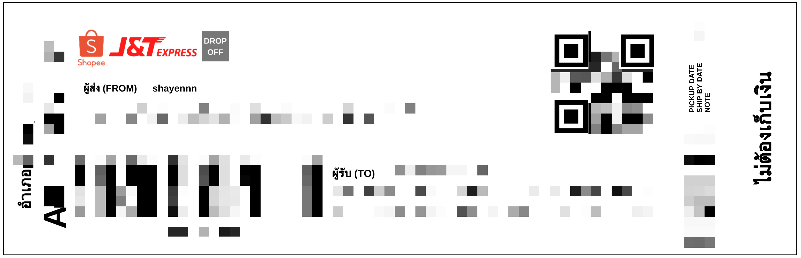

# ShopeeMiniPeripage

This is a mini project to convert Shopee Thailand AWB PDF to strip-style AWB for printing on Peripage A6 printer.

## Table of Contents

- [ShopeeMiniPeripage](#shopeeminiperipage)
  - [Table of Contents](#table-of-contents)
  - [Preview](#preview)
    - [Original Style](#original-style)
    - [Strip Style](#strip-style)
  - [Installation](#installation)
  - [Usage](#usage)
    - [Convert AWB PDF to Image](#convert-awb-pdf-to-image)
    - [Crop Image and Generate Strip-Style AWB](#crop-image-and-generate-strip-style-awb)
  - [License](#license)

## Preview

### Original Style


### Strip Style



## Installation

```bash
conda create --name ShopeePeripage python=3.12
conda activate ShopeePeripage
pip install -r requirements.txt
```

## Usage

### Convert AWB PDF to Image

```bash
python main.py
```

### Crop Image and Generate Strip-Style AWB

```bash
python crop.py
```

## License

[MIT](https://choosealicense.com/licenses/mit/)
